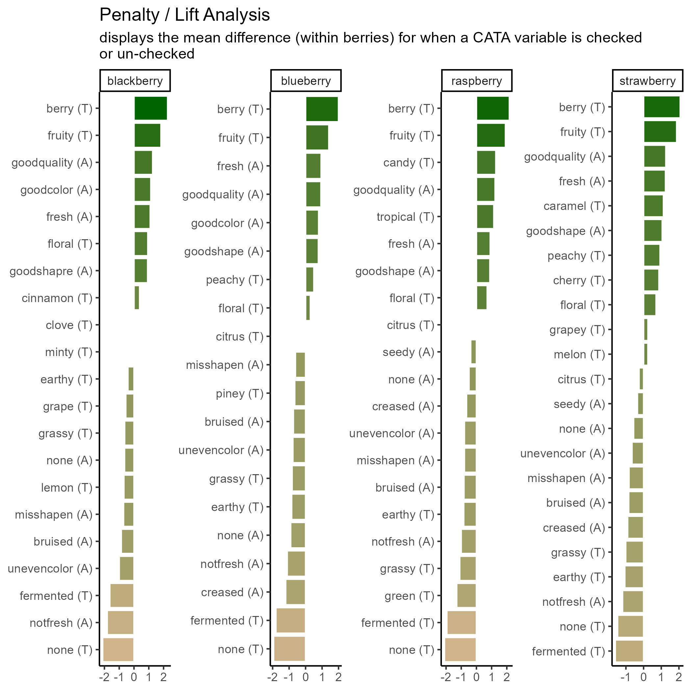
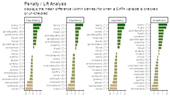
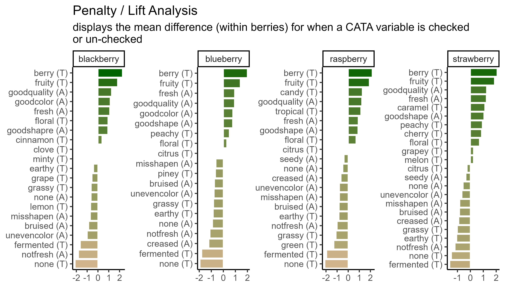

# Fine-Tuning Publication-Quality ggplots

```{r setup-5, include = FALSE, purl = FALSE}
library(tidyverse)
berry_data <- read_csv("data/clt-berry-data.csv")
berry_penalty_data <- read_csv("data/berry-penalty-data.csv")
raw_cider_data <- read_csv("data/CiderDryness_SensoryDATA.csv")
load("data/svd-results.RData")
load("data/long-data-objects.RData")
knitr::opts_chunk$set(fig.align = "center", warning = FALSE)

berry_data %>%
  pivot_longer(cols = matches("^(9pt|us|lms)_"),
               names_to = c("Scale", "Attribute"), names_sep = "_",
               values_to = "Liking",
               values_drop_na = TRUE) %>%
  select(where(~ !any(is.na(.x)))) %>%
  mutate(Liking = ifelse(Scale == "lms",
                         (Liking + 100) * 8/200 + 1,
                         ifelse(Scale == "us",
                                Liking * 8/15 + 1,
                                Liking))) %>%
  select(Subject = `Subject Code`, Sample = `Sample Name`, berry,
         starts_with("cata_"), Attribute, Scale, Liking) -> berry_data_long
```

The plots we've been making so far are fairly straightforward demonstrations. At the very end of Chapter 3, we briefly showed you the code and results for this plot:

```{r penalty analysis example, fig.width = 7}
berry_penalty_data %>%
  select(-count) %>%
  pivot_wider(names_from = checked,
              values_from = penalty_lift,
              names_prefix = "checked_") %>%
  separate(cata_variable, 
           into = c("mode", "variable"), 
           sep = "_") %>%
  mutate(penalty_lift = checked_1 - checked_0,
         mode = case_when(mode == "taste" ~ "(T)",
                          mode == "appearance" ~ "(A)",
                          mode == "appearane" ~ "(A)")) %>%
  unite(variable, mode, col = "cata_variable", sep = " ") %>%
  mutate(cata_variable = tidytext::reorder_within(x = cata_variable,
                                                  by = penalty_lift,
                                                  within = berry)) %>%
  ggplot(mapping = aes(x = cata_variable, y = penalty_lift)) +
  geom_col(aes(fill = penalty_lift), color = "white", show.legend = FALSE) + 
  facet_wrap(~berry, scales = "free", nrow = 1) + 
  tidytext::scale_x_reordered() + 
  coord_flip() + 
  theme_classic() + 
  scale_fill_gradient(low = "tan", high = "darkgreen") + 
  labs(x = NULL, y = NULL,
       title = "Penalty / Lift Analysis",
       subtitle = "displays the mean difference (within berries) for when a CATA variable is checked\nor un-checked") ->
  goal_plot

goal_plot
```

Which uses some tricks from the `stringr` and `tidytext` packages in order to give us easy-to-read labels. Using the existing column names and variable-codes in our original data, it would've looked more like this:

```{r worse penalty analysis example, fig.width = 7}
berry_penalty_data %>%
  select(-count) %>%
  pivot_wider(names_from = checked,
              values_from = penalty_lift,
              names_prefix = "checked_") %>%
  mutate(penalty_lift = checked_1 - checked_0) %>%
  ggplot(mapping = aes(x = cata_variable, y = penalty_lift)) +
  geom_col(aes(fill = penalty_lift), color = "white", show.legend = FALSE) + 
  facet_wrap(~berry, scales = "free", nrow = 2) +
  coord_flip() + 
  theme_classic() + 
  scale_fill_gradient(low = "tan", high = "darkgreen")
```

Which we're showing because we have seen similar plots published in journal articles, with the overlapping text, redundant axis labels, and all.

## Exporting and Saving Plots

It may seem like a weird time to be talking about saving plots, when we haven't gotten to the "fine-tuning" yet, but you should already be familiar with a few examples of things that change when the aspect ratio of the plot or the monitor you're viewing it on changes slightly. It is basically impossible to export a `ggplot` at the resolution needed for publishing without changing the aspect ratio, relative sizes, or space between some elements from what you're looking at in the Plots pane or the `.Rmd` chunk output.

It's good practice to export your plot as an image (or pdf or knit-together document or however else you plan to export it) and re-export it periodically as you go through fine-tuning.

This is also, probably, the most important part of this chapter. You will have to get every plot that you publish out of `R` somehow, after all! The rest of the advice in this chapter are tricks that we draw upon frequently, but you may find that you have different problems or priorities, or that some of these needs are situational.

But you will have to export plots for every project you want to share with the world.

### What format?

You can, as we've already discussed, save a `ggplot` object in a `.rds` file. But that won't let you put it into your powerpoint, or manuscript, or take it to the printer. You need an image file. The exact *type* of image will depend on the other software you're using for your report, presentation, paper, book, etc.

There are two major ways to save the kind of spatial color data that comprise images such as graphs. You can store them as **vector graphics**, which can be rescaled because they're made up of lines and shapes (we'll be talking about `.pdf` and `.svg`) or as **raster (bitmap) graphics**, which store images as a grid of **pixels** which each have a single uniform color (we'll be talking about `.png` and `.jpeg`).

`.pdf` vector images are best for **LaTeX**
`.svg` vector images are more widely supported in word processors
`.png` raster images are the most predictable to print, the best for web publishing, and can be used in pretty much every software ever made, *if* you know exactly the size you want. 
`.jpeg` (along with `.tiff`) raster images are the raster formats preferred by *Food Quality and Preference* editors. They are worse for web publishing than `.png` but share its other advantages.

Note that `ggsave()` works like making a `.pdf` version of your working documents: you will not be able to read the plot images into R for editing anymore, no matter which format you save in.

### Exporting Images with `ggsave()`
The easiest way to reproducibly save plots, so that all of your export options are in your code and you might be able to recreate it on a different computer, is with the function `ggplot2::ggsave()`, which works *similarly* to the `write_*()` functions and `save()`. You give it a file name to save to, relative to the current working directory, and 

`ggsave()` supports all of the above-named image formats, as well as `.eps`, `.ps`, `.tex` (pictex), and `.bmp`. If you're reading this right now, you're looking at a webpage created using `bookdown` and `knitr`. We can't actually directly embed `.pdf` images in this site, but let's look at a few other example formats using the same plots.

```{r exporting a plot in multiple formats}
ggsave("img/penalty-lift-svg.svg", goal_plot)
ggsave("img/penalty-lift-png.png", goal_plot)
ggsave("img/penalty-lift-jpeg.jpeg", goal_plot)
```

It will figure out from the file extension (the stuff after the `.` in the `filename` argument) what image type it's saving as, but you can also specify it explicitly with the `device` argument.

Now let's compare how each of these looks!

```{r viewing the plot inside R, fig.width = 7}
goal_plot
```
```{r showing off plot types, echo = FALSE, purl = FALSE, out.width = 7}



```

The two raster formats look basically the same, and only slightly different from the `.svg`. You'll notice that these saved plots all look more similar to each other than they do to the initial plot we previewed inside R. The text in *all* of the plots has a bit more space around it using `ggsave()`, the bars are taller, and the plot aspect ratio is different.

We can adjust these using the rest of the arguments to `ggsave()`, namely the `scale`, `width`, `height`, `units`, and, for rasters, `dpi`.

You might be surprised that vector images have height and width options, because we already said they don't have a fixed display size, but as you saw a few code chunks ago, `ggsave()` picked a default image size of 7x7 inches when we didn't specify. The height and width are mostly important for determining the relative sizing of elements like text and whitespace.

`ggplot2` actually saves the sizes of certain plot elements, namely *text* and most `geom_*()`s, in inches or millimeters. When it has to construct an actual version of the plot at a given size, it tries to keep all of the 12-pt text 1/6" tall (1 inch = 72 points). This 12-point font will take up a very small amount of a 4-foot-tall image, but a sixth of a 1" image.

The fact that you can then print the `.svg` at any size you want is out of `ggplot2`'s hands. It will try to make the fonts and elements the right size for the size you're *telling it* you will print.

If you get to this stage and realize that all of the fixed-size elements (e.g., text) are too big or too small, you can use `ggsave()`'s `scale` argument. `scale` < 1 makes all the fixed-size elements *smaller* relative to the plot size and `scale` > 1 makes all the elements *bigger* relative to the plot size. `scale` < 1 will generally also give you a *larger plot area* and *more space between your geoms*.

```{r saving vector plots at different sizes and scales}
ggsave("img/penalty-lift-svg-7x4.svg", goal_plot,
       width = 7, height = 4, units = "in")

ggsave("img/penalty-lift-svg-14x8.svg", goal_plot,
       width = 14, height = 8, units = "in")

ggsave("img/penalty-lift-svg-14x8-rescale.svg", goal_plot,
       width = 14, height = 8, units = "in", scale = .5)
```

```{r showing off vector plot scaling, echo = FALSE, purl = FALSE, out.width = 7}
knitr::include_graphics('img/penalty-lift-svg-7x4.svg')
knitr::include_graphics('img/penalty-lift-svg-14x8.svg')
knitr::include_graphics('img/penalty-lift-svg-14x8-rescale.svg')
```

All of these `.svg` images are *displayed* at 7x4" on your screen, but the plot we made with `width = 14, height = 8` has smaller text and larger plotting areas unless we correct this with `scale`. `penalty-lift-svg-7x4.svg` and `penalty-lift-svg-14x8-rescale.svg` are actually identical files.

You should *avoid using `scale` for rasters*, as it will create plots that will not print at the size (`width` and `height`) and resolution (`dpi`) you specified.

### Image Sizes and Raster Resolutions
All raster images are made up of grids of dots or pixels. Once you export a figure from R as a `.png`, `.jpeg`, or other raster format, *you cannot resize it*. It will look blurry or blocky if you try to make it bigger, and even slight changes to the **aspect ratio** (width/height), the text and other plot elements will be noticeably stretched out.

You'll have fewer problems if you save an image that's way too big (i.e., has too many pixels) for what you need, so long as it's the right aspect ratio and all the plot elements have relative sizes that work at the scale you'll be printing. (See [this short primer on "Using R Plots in Documents" from the University of Wisconsin-Madison](https://sscc.wisc.edu/sscc/pubs/using-r-plots/saving-plots.html#file-dimensions) for examples.)

So, how big is a pixel? How many pixels are in an inch? It depends! (On the pixel density for screens and the resolution for printing, see [the discussion on this page](https://graphicdesign.stackexchange.com/questions/6080/what-is-the-difference-between-dpi-dots-per-inch-and-ppi-pixels-per-inch) for details.)

- Most modern computer monitors have something like 90-120 pixels per inch (ppi)
- Microsoft Powerpoint uses an internal resolution of 96 ppi as a default, [although images will print at more than 96 dpi if they're sized appropriately](https://www.brightcarbon.com/blog/powerpoint-picture-size-and-resolution/).
- Older Apple software has a default of 72 ppi
- `ggsave()` uses a default of 300 dpi
- Poster printers will usually print at 300 dots per inch (dpi). They may ask for a minimum resolution of anywhere between 120-300 dpi, although 300 dpi will usually be a safe bet. Use your specific printer's recommendations.
- Elsevier journals like *Food Quality and Preference* [suggest at least 300 dpi for all images and at least 500 dpi for "combination art", which includes all R plots with colored or shaded areas](https://www.elsevier.com/about/policies-and-standards/author/artwork-and-media-instructions/artwork-sizing).

This is important because, if you have a 600x600-pixel raster image, and you try to print it any bigger than 2 inches x 2 inches on a 300 dpi printer, then you have *missing image data* and the printed version will look blurry. 

Whenever something, like a design software or an R function to save a plot, gives you the chance to enter an image size in inches or centimeters, *you should figure out what dpi or ppi it's using*. It may be easier to figure out the final pixel size you want and export something that size or bigger. (For more details, see [this (slightly outdated) guide on "Preparing Images for PowerPoint, the Web, and Publication" from the University of Michigan](https://apps.lib.umich.edu/files/services/exploratory/pdfs/preparingimages.pdf).)

You can see the possible image widths and corresponding pixel sizes for Elsevier journals [here](https://www.elsevier.com/about/policies-and-standards/author/artwork-and-media-instructions/artwork-sizing). For PowerPoint presentations, assume you're filling a 13.3x7.5" space at 150 dpi. For printed posters, you'll find the final poster size on the competition guidelines and the final resolution from your printer. 12"x12" for a single figure at 300 dpi is a good place to start.

You *will* almost certainly have to re-export your figures several times in order to get the sizing and aspect ratios right.

Let's save a the same plots as a raster image (`.png`) with a few different `dpi` values.

```{r saving raster plots at different sizes and resolutions}
ggsave("img/penalty-lift-png-50dpi.png", goal_plot,
       width = 7, height = 4, units = "in", dpi = 50)

ggsave("img/penalty-lift-png-300dpi.png", goal_plot,
       width = 7, height = 4, units = "in") #default dpi = 300

ggsave("img/penalty-lift-png-500dpi.png", goal_plot,
       width = 7, height = 4, units = "in", dpi = 500)
```

```{r showing off vector plot scaling, echo = FALSE, purl = FALSE, out.width = 7}



```

You can see that all of the 7x4" raster plots look basically the same, except the first one is a little blurry when it's sized up to match the other two. This is the problem we're trying to avoid.

Unlike `scale`, the `dpi` argument does not resize any of the (it doesn't change the size of a "point" from 1/72"). But let's say we need a 300 dpi copy of this image printed at 14x8". We already know that the 14x8" output has text that's too small to read from afar.

In cases like these, it may be easier to output a size with the right *aspect ratio* that looks good and is legible, then figure out what `dpi` you'll need to print it. If we need a 14x8" plot at 300 dpi, that's `14 * 300 = 4200` pixels wide by `8 x 300 = 2400`. We can fake this with our 7x4" plot at 600 dpi, since `4200 / 7 = 600` and `2400 / 4 = 600`.

### Other Image Export Options

This is not a `knitr` or `bookdown` tutorial, because we had to choose our topics, but we used the `bookdown` package to make the [online webpage version of this tutorial](https://lhami.github.io/sensometrics-r-tutorial-2024/). It comes with its own advantages and challenges, but it does significantly streamline the image-generation process for any project where the only file you need is one LaTeX or `.pdf` output with all of the text and all of the figures. If that sounds appealing to you, turn your attention to ["bookdown: Authoring Books and Technical Documents with R Markdown" by Yihui Xie](https://bookdown.org/yihui/bookdown/).

## Making Text Look Okay

A good R variable or column name doesn't have any spaces or punctuation other than underscores (`_`) and dots (`.`), to avoid all those pesky backticks (`\``) in our code.

This is very different from what a good label in a plot looks like. You'll often want to make some sort of mass changes to column names or text variables before plotting, in order to address this. In our previous example, we used `separate()` to split one messy column with variable names into two, adjusted each one, and then used `unite()` to combine them again:

```{r separate and unite}
berry_penalty_data %>%
  select(-count) %>%
  pivot_wider(names_from = checked,
              values_from = penalty_lift,
              names_prefix = "checked_") %>%
  separate(cata_variable, 
           into = c("mode", "variable"), 
           sep = "_") %>%
  mutate(penalty_lift = checked_1 - checked_0,
         mode = case_when(mode == "taste" ~ "(T)",
                          mode == "appearance" ~ "(A)",
                          mode == "appearane" ~ "(A)")) %>%
  unite(variable, mode, col = "cata_variable", sep = " ")
```

### Powerful Text Manipulation with `stringr`

The `stringr` package is a part of the `tidyverse`, so you have it already loaded whenever you run `library(tidyverse)`. It has a lot of useful functions for working with text (called "**str**ings" in many programming languages), mostly of the form `str_*()`. One thing you can do is change labels to uppercase, lowercase, or "title case" (first letter of each word capitalized), as appropriate:

```{r capitalizing with stringr}
berry_penalty_data %>%
  select(berry) %>%
  mutate(Upper = str_to_upper(berry),
         Title = str_to_title(berry)) # Capitalizes the first letter of each word
```

It also has its own version of `unite()` called `str_c()`, although it works on vectors (e.g., inside `mutate()`) rather than on whole tables like a `dplyr` verb.

On the other hand, if you don't need to do the intermediate step of changing the `separate()`d parts, `str_replace()` and `str_replace_all()` are very useful for dealing with underscores or periods. You give it `string`, the text vector you want to modify (inside `mutate()`, a column name); then `pattern`, the character(s) you want to replace; then `replacement`, what you want to replace them with.

```{r replacing underscores with str_replace}
berry_penalty_data %>%
  select(-count) %>%
  pivot_wider(names_from = checked,
              values_from = penalty_lift,
              names_prefix = "checked_") %>%
  mutate(cata_variable = str_replace_all(cata_variable, "_", ": "))
```

They can both be as long as you like. If `pattern = _` and there's more than one `_` in one of the `string`s, `str_replace()` will only replace the first one and `str_replace_all()` will replace them all.

```{r str_replace vs str_replace_all}
str_replace("long_text_with_many_underscores", "_", " ")
str_replace_all("long_text_with_many_underscores", "_", " ")
```

You can add multiple sets of `pattern`s and `replace`ments to `str_replace_all()` using a named list: `c("pattern1" = "replace1", "pattern2" = "replace2"`. This is useful to, for instance, fix multiple typos like "goodshapre". Unlike the `case_when()` example we showed before, you can fix typos that occur anywhere in the text, even if they're only parts of a word.

```{r fixing typos with str_replace}
berry_penalty_data %>%
  select(-count) %>%
  pivot_wider(names_from = checked,
              values_from = penalty_lift,
              names_prefix = "checked_") %>%
  mutate(cata_variable = str_replace_all(cata_variable,
                                         c("shapre" = "shape",
                                           "appearane" = "appearance",
                                           "_" = " ")))
```

Be careful using short `pattern`s, because they will replace every example *even if it's only part of a word*.

```{r replacing parts of words}
#This can lead to unintentional side-effects
c("nocolor", "none", "cornonthecob", "anode") %>%
  str_replace_all("no", " NO ")

#Or it can be useful for fixing lots of similar problems all at once
berry_penalty_data %>%
  select(-count) %>%
  pivot_wider(names_from = checked,
              values_from = penalty_lift,
              names_prefix = "checked_") %>%
  mutate(cata_variable = str_replace_all(cata_variable,
                                         c("not" = "not ",
                                           "good" = "good ",
                                           "uneven" = "uneven ",
                                           "_" = " ")))
```

### `stringr` and Regular Expressions

So far, we've been replacing letters and underscores, which is what we have in our example data. You can also use `str_replace()` for periods (`.`), although you may be surprised when you first try:

```{r str_replace with periods}
str_replace_all("long.text.with.many.periods", ".", " ") # Replaces everything
str_replace_all("long.text.with.many.periods", "\\.", " ") # Replaces only dots
```

We have to **escape** the period (with an escaped backslash, actually, but for now just know that the two backslashes `\\` are the `stringr` escape sequence), because the `str_*` functions with a `pattern` can use **Regular Expressions** (or regex). Regex are extremely powerful tools for finding patterns in text, similar to the intuitive ways a human might recognize something like an email address, a measurement, or a parenthetical.

```{r some regex examples}
str_extract("If you want to get in touch with me you can do so at lhamilton@vsu.edu.",
            "\\w*@\\w+\\.(edu|gov|com|org|biz|net|fr|co\\.uk)\\b")
str_extract_all("Our 300th measurement was 10.31 cm, our 301st clocked in at 3.213in",
            "\\d+\\.\\d+ ?(cm|in|m)")
str_extract_all("Regular Expressions (regex) are one tool in Natural Language Processing (NLP)",
            "(?<=\\()[^)]*(?=\\))")
```

You can try changing the searched `string` in the above code to see if it recognizes your email or how many numbers you can get it to recognize. Usually, though, your plot labels aren't in full sentences in your data frame. Simpler regular expressions can still save you a lot of work:

```{r cleaning up a character variable with str_replace and regex}
berry_penalty_data %>%
  select(-count) %>%
  pivot_wider(names_from = checked,
              values_from = penalty_lift,
              names_prefix = "checked_") %>%
  mutate(cata_variable = str_replace(cata_variable,
                                     "^(.).*_(.*)",
                                     "\\2 (\\1)"),
         cata_variable = str_to_title(cata_variable))
```

You do not *have* to learn regular expressions to clean up messy text, but being comfortable with them will (eventually) make you faster. You should at least learn the characters (`\`, `.`, `[`, `]`, `{`, `}`, `(`, `)`, `<`, `>`, `*`, `+`, `-`, `=`, `!`, `?`, `^`, `$`, and `|`) that will need to be **escaped** with two backslashes if you need to replace them. It will help you troubleshoot any weird results you get from the `str_*()` functions.

If you want to learn more, we'd recommend starting with [the `stringr` package's own vignette on regular expressions](https://stringr.tidyverse.org/articles/regular-expressions.html), which you can view with `vignette("regular-expressions", "stringr")`. If you want more practice, you can then follow along with the [RegexOne](https://regexone.com/) tutorial or [RegexTutorials](http://regextutorials.com/index.html).

Any "perl-flavored" regex tutorial or resource will work, with the exception that *you will have to double the number of backslashes (`\`)* to use them in R.

## Removing Legends and Plot Elements

You've already seen us use `+ theme(panel.grid = element_blank())` to get rid of the grid lines in a plot. You can use `element_blank()` to get rid of lots of plot elements you might not want for whatever reason, usually because it's redundant with information you have elsewhere and thus just making the plot look more complicated or harder to read at a glance. The most common things you might want to remove are:

- `plot.title`, if some function added a title to the top of your plot and you want to get rid of it.
- `axis.title`, `axis.title.x`, or `axis.title.y` if you don't need the column name(s) labeling your axes
- `axis.ticks`, `axis.ticks.x`, or `axis.ticks.y` if you want to remove the little tick marks along a given axis (useful for bar plots)

```{r removing the legend and the axis ticks}
berry_data_long %>%
  ggplot(aes(x = Scale, y = Liking, color = Scale)) +
  ggbeeswarm::geom_quasirandom() +
  facet_wrap(~ Attribute) +
  theme_bw() +
  theme(panel.grid = element_blank(),
        axis.ticks = element_blank(),
        legend.position = "none")
```

You can see a nearly-full list of the arguments to `ggplot2::theme()` in the theme help files (`?theme`), unlike with `ggplot2` aesthetics and the `geom_*()` help files.

If you want to remove the legend, you use `+ theme(legend.position = "none")`, but if you want to remove *specific geoms* from the legend, then you have to adjust your `geom_*()` calls.

```{r excluding geoms from the legend}
ca_cider$col$coord %>%
  as_tibble(rownames = "Attribute") %>%
  mutate(Modality = case_when(Attribute == "Sweet" ~ "Taste",
                              Attribute == "Bitter" ~ "Taste",
                              Attribute == "Sour" ~ "Taste",
                              Attribute == "Smooth" ~ "Mouthfeel",
                              Attribute == "Dry" ~ "Mouthfeel",
                              Attribute == "FullBodied" ~ "Mouthfeel",
                              .default = "Aroma")) %>%
  ggplot(aes(x = `Dim 1`, y = `Dim 2`,
             label = Attribute, color = Modality)) -> ca_cider_colored

ca_cider_colored +
  geom_point() +
  ggrepel::geom_text_repel()

ca_cider_colored +
  geom_point() +
  ggrepel::geom_text_repel(show.legend = FALSE)
```

## Ordered Categorical Variables

Many of the figures we've made so far have had one axis with a categorical variable. Have you figured out how `ggplot2` orders the levels of categorical variables? If you have noticed, it's likely because it's in a different order than the one we'd like.

```{r default categorical axis in ggplot2}
long_cider_data %>%
  filter(checked == 1) %>%
  ggplot(aes(x = cata_variable)) +
  geom_bar() +
  coord_flip() +
  facet_grid(vars(Temperature), vars(Sample_Name))
```

The CATA attributes are in alphabetical order. This is how `ggplot2` treats all `character` variables, and you can exert some control over the ordering by turning the variable into an ordered `factor`.

### Specifying Ordinal Variables as Factors

You can order variables by hand, if there's a particular order you have in mind:

```{r}
long_cider_data %>%
  mutate(cata_variable = factor(cata_variable,
                                levels = c("Sweet", "Sour", "Bitter",
                                           "Smooth", "Dry", "FullBodied",
                                           "Light",
                                           "Fruity", "Berries", "Fresh_Apples",
                                           "Floral", "Spice",
                                           "Herbal", "Woody", "Earthy",
                                           "Funky", "Fermented", "Vomit",
                                           "Synthetic", "Candy",
                                           "Metallic", "Alcohol"))) -> long_cider_manual_factors

long_cider_manual_factors %>%
  filter(checked == 1) %>%
  ggplot(aes(x = cata_variable)) +
  geom_bar() +
  coord_flip() +
  facet_grid(vars(Temperature), vars(Sample_Name))
```

Note that the attribute you list *first* when you're specifying the `levels` will become 1, then 2, then 3. With `coord_flip()`, that puts it at the bottom of the plot.

```{r}
long_cider_manual_factors %>%
  distinct(cata_variable) %>%
  mutate(variable_number = as.numeric(cata_variable))
```

This gives us control, but it's pretty annoying to write out for large lists of attributes, and you have to be sure the spelling and capitalization match exactly. Often, like with the penalty analysis plots, what we actually want to do is order the Attributes in terms of some other numerical variable, like frequency or size of penalty.

One way is to `arrange()` the data the way you want it and then use that order to specify the levels.

```{r}
long_cider_data %>%
  # Counting the number of times each attribute is used across all products:
  group_by(cata_variable) %>%
  mutate(variable_count = sum(checked)) %>%
  ungroup() %>%
  # Arranging from least-to-most used:
  arrange(variable_count) %>%
  # Converting to a factor, so the least-used will be 1st, then the next:
  mutate(cata_variable = factor(cata_variable, levels = unique(cata_variable),
                            ordered = TRUE),
         variable_number = as.numeric(cata_variable)) -> long_cider_frequency_factors

#Now the plot:
long_cider_frequency_factors %>%
  filter(checked == 1) %>%
  ggplot(aes(x = cata_variable)) +
  geom_bar() +
  coord_flip() +
  facet_grid(vars(Temperature), vars(Sample_Name))
```

### Facets with Different Category-Orders

You'll notice that our reordered categorical axes still have the same order across all of the plots. This would be true even if we changed our `group_by()` call and used within-product sums to calculate `level`s. The order is based on factor levels for a single column, and `Fresh_Apples` can't be "more than" `Dry` in one part of the column and "less than" in another part.

On its own, `facet_wrap(..., scales = "free")` can drop unneeded attributes from plots, but it will still keep the same *order* of the attributes across all axes.

If you have a faceted plot and you want each facet to have a different ordering of the terms, like in our big penalty analysis example, you'll have to use `tidytext::reorder_within()`, `tidytext::scale_*_reordered()`, *and* `facet_wrap(..., scales = "free")`, all at once:

```{r}
long_cider_data %>%
  # Counting the number of times each attribute is used across all products:
  group_by(Sample_Name, Temperature, cata_variable) %>%
  mutate(Product = str_c(Sample_Name, " (", Temperature, ")"),
         variable_count = sum(checked),
         cata_variable = tidytext::reorder_within(cata_variable,
                                                  by = variable_count,
                                                  within = list(Sample_Name, Temperature))) %>%
  ungroup() %>%
  filter(checked == 1) %>%
  ggplot(aes(x = cata_variable)) +
  geom_bar() +
  tidytext::scale_x_reordered() +
  coord_flip() +
  # This will not work with facet_grid, because it forces all plots in a row to
  # share a vertical axis, even with scales = "free"
  facet_wrap(~ Product,
             scales = "free")
```

## Putting it all together

Now, at long last, we're ready to walk line-by-line through the example penalty analysis figure that we've just been copy-pasting so far in the workshop.

```{r final walkthrough of penalty analysis, fig.width = 7}
berry_penalty_data %>%
  select(-count) %>%
  pivot_wider(names_from = checked,
              values_from = penalty_lift,
              names_prefix = "checked_") %>%
  separate(cata_variable, 
           into = c("mode", "variable"), 
           sep = "_") %>%
  mutate(penalty_lift = checked_1 - checked_0,
         mode = case_when(mode == "taste" ~ "(T)",
                          mode == "appearance" ~ "(A)",
                          mode == "appearane" ~ "(A)")) %>%
  unite(variable, mode, col = "cata_variable", sep = " ") %>%
  mutate(cata_variable = tidytext::reorder_within(x = cata_variable,
                                                  by = penalty_lift,
                                                  within = berry)) %>%
  ggplot(mapping = aes(x = cata_variable, y = penalty_lift)) +
  geom_col(aes(fill = penalty_lift), color = "white", show.legend = FALSE) + 
  facet_wrap(~berry, scales = "free", nrow = 1) + 
  tidytext::scale_x_reordered() + 
  coord_flip() + 
  theme_classic() + 
  scale_fill_gradient(low = "tan", high = "darkgreen") + 
  labs(x = NULL, y = NULL,
       title = "Penalty / Lift Analysis",
       subtitle = "displays the mean difference (within berries) for when a CATA variable is checked\nor un-checked")
```