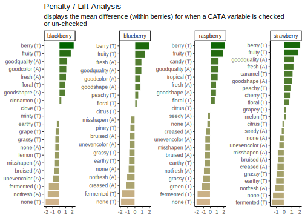
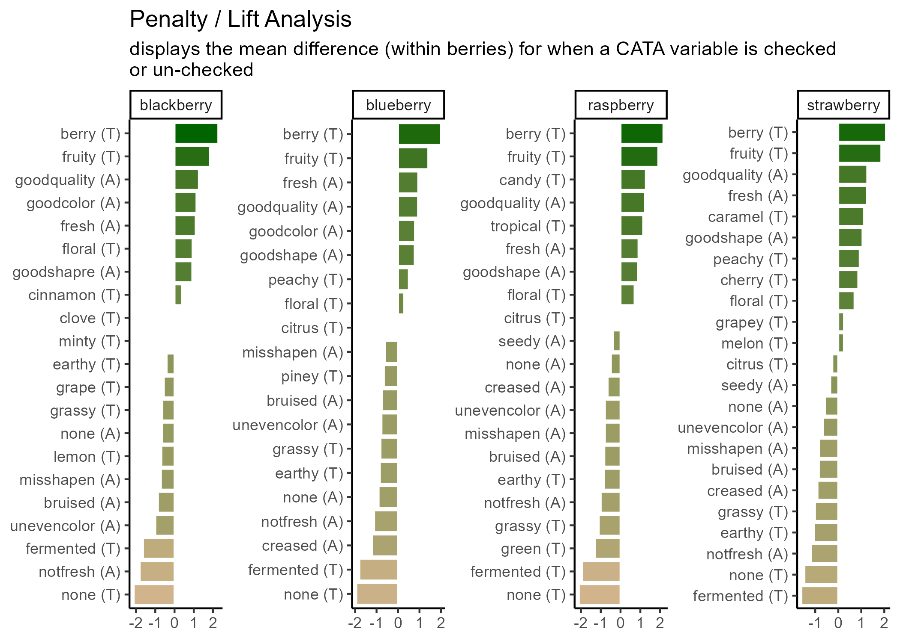
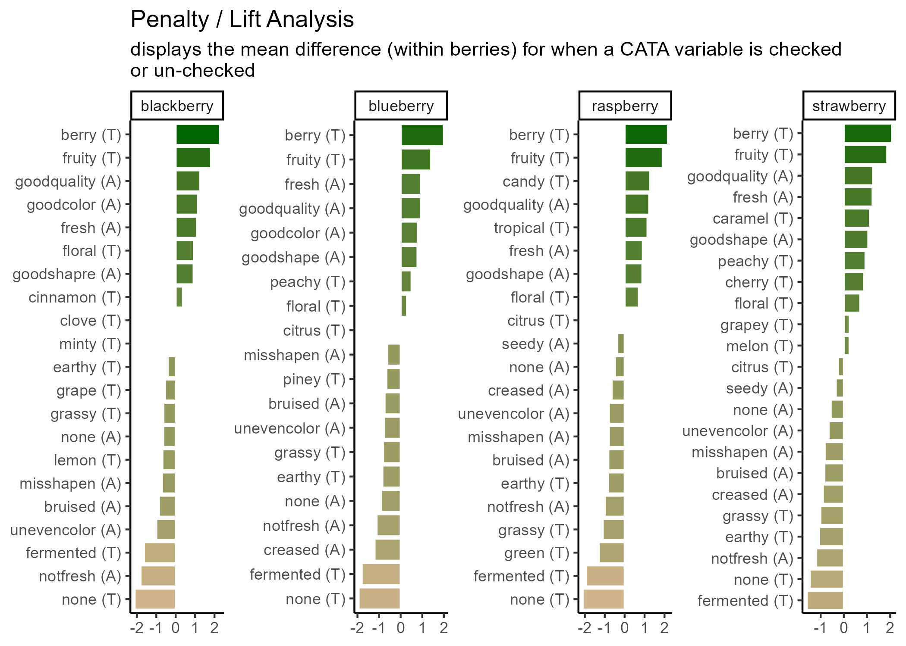
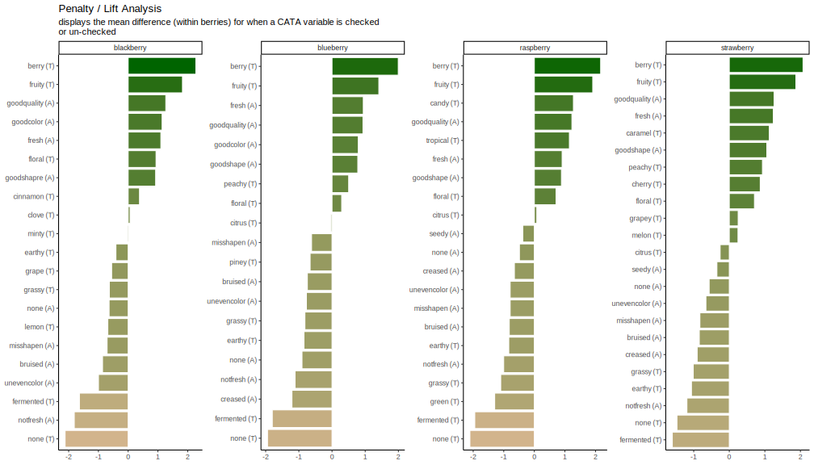
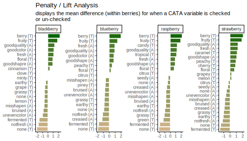

# Fine-Tuning Publication-Quality ggplots


The plots we've been making so far are fairly straightforward demonstrations. At the very end of Chapter 3, we briefly showed you the code and results for this plot:


```r
p1_berry_penalty
```


Which uses some tricks from the `stringr` and `tidytext` packages in order to give us easy-to-read labels. Using the existing column names and variable-codes in our original data to make a first draft of a plot, it would've looked more like this:


```r
berry_penalty_analysis_data %>%
  select(-count) %>%
  pivot_wider(names_from = checked,
              values_from = penalty_lift,
              names_prefix = "checked_") %>%
  mutate(penalty_lift = checked_1 - checked_0) %>%
  ggplot(mapping = aes(x = cata_variable, y = penalty_lift)) +
  geom_col(aes(fill = penalty_lift), color = "white", show.legend = FALSE) + 
  facet_wrap(~berry, scales = "free", nrow = 2) +
  coord_flip() + 
  theme_classic() + 
  scale_fill_gradient(low = "tan", high = "darkgreen")
```


Which we're showing because we have seen similar plots published in journal articles, with the overlapping text, redundant axis labels, and all. We can make this more readable by reordering the CATA attributes, shortening and reformatting the labels, and possibly by removing some extraneous elements like the `cata_variable` label on the Y axis. These are common steps that make a huge difference.

And we'll get there, but first...

## Exporting and Saving Plots

It may seem like a weird time to be talking about saving plots, when we haven't gotten to the "fine-tuning" yet, but you should already be familiar with a few examples of things that change when the aspect ratio of the plot or the monitor you're viewing it on changes slightly. It is basically impossible to export a `ggplot` at the resolution needed for publishing without changing the aspect ratio, relative sizes, or space between some elements from what you're looking at in the Plots pane or the `.Rmd` chunk output.

It's good practice to export your plot as an image (or pdf or knit-together document or however else you plan to export it) and re-export it periodically as you go through fine-tuning.

This is also, probably, the most important part of this chapter. You will have to get every plot that you publish out of `R` somehow, after all! After that, we'll cover some tricks that we draw upon frequently, but you may find that you have different problems or priorities, or that some of these needs are situational.

But you will have to export plots for every project you want to share with the world.

### What format?

You can, as we've already discussed, save a `ggplot` object in a `.rds` file. But that won't let you put it into your powerpoint, or manuscript, or take it to the printer. You need an image file. The exact *type* of image will depend on the other software you're using for your report, presentation, paper, book, etc.

There are two major ways to save the kind of spatial color data that comprise images such as graphs. You can store them as **vector graphics**, which can be rescaled because they're made up of lines and shapes (most commonly, `.pdf` and `.svg`) or as **raster (bitmap) graphics**, which store images as a grid of **pixels** which each have a single uniform color (most commonly, `.png` and `.jpeg`).

-  `.pdf` vector images are best for **LaTeX** and professional publishing
-  `.svg` vector images are more widely supported in word processors and websites
-  `.png` raster images are the most predictable to print, the best for web publishing, and can be used in pretty much every software ever made, *if* you know exactly the size you want. 
-  `.jpeg` (along with `.tiff`) raster images are the raster format preferred by *Food Quality and Preference* editors. They are worse for web publishing than `.png` but share its other advantages.

Note that `ggsave()` is like making a `.pdf` version of your working documents: you will not be able to read the plot images into `R` for editing anymore, no matter which format you save in.

### Exporting Images with `ggsave()` {#ggsave}
The easiest way to reproducibly save plots, so that all of your export options are in your code and you might be able to recreate it on a different computer, is with the function `ggplot2::ggsave()`, which works *similarly* to the `write_*()` functions and `save()`. You give it a file name to save to, relative to the current working directory, and then the variable where your plot is saved.


```r
ggsave("img/penalty-lift-png.png", p1_berry_penalty)
```

`ggsave()` supports all of the above-named image formats, as well as `.eps`, `.ps`, `.tex` (pictex), and `.bmp`. It will figure out from the file extension (the stuff after the `.` in the `filename` argument) what image type it's saving as, but you can also specify it explicitly with the `device` argument.

If you're reading this right now, you're looking at a webpage created using `bookdown` and `knitr`. We can't actually directly embed `.pdf` images in this site, but let's look at a few other example formats using the same plots.


```r
ggsave("img/penalty-lift-svg.svg", p1_berry_penalty)
ggsave("img/penalty-lift-jpeg.jpeg", p1_berry_penalty)
```

Now let's compare how each of these looks! First, inside R:


```r
p1_berry_penalty # If you're following along, this will look different in your R session!
```


The `.svg` image made by `ggsave()`:



The `.png` image made by `ggsave()`:



The `.jpeg` image made by `ggsave()`:



The two raster formats look basically the same, and only slightly different from the `.svg` and the version in the `.html` version of this tutorial. If you're following along in your own `R` session, however, you'll notice that these saved plots all look more similar to each other than they do to the initial plot you're previewing inside `R`. *All* of the plots have a bit more space around the text using `ggsave()`, taller bars, and a different aspect ratio ($width/height$).

We can adjust these using the rest of the arguments to `ggsave()`. The `width`, `height`, and `units` primarily control the image size (for raster images) and aspect ratio (for all images), but they also affect the relative size of plot elements. Larger plots will have axis labels, text, and `geom_*()`s that take up less of the overall plotting area, and vice-versa for smaller images.

If you get to this stage with a **vector image** and realize that all of the fixed-size elements (e.g., text) are too big or too small, you can use `ggsave()`'s `scale` argument. `scale` < 1 makes all the fixed-size elements *smaller* relative to the plot size and `scale` > 1 makes all the elements *bigger* relative to the plot size. `scale` < 1 will generally also give you a *larger plot area* and *more space between your geoms*.


```r
ggsave("img/penalty-lift-svg-7x4.svg", p1_berry_penalty,
       width = 7, height = 4, units = "in")

ggsave("img/penalty-lift-svg-14x8.svg", p1_berry_penalty,
       width = 14, height = 8, units = "in")

ggsave("img/penalty-lift-svg-14x8-rescale.svg", p1_berry_penalty,
       width = 14, height = 8, units = "in", scale = .5)
```

The 7x4" vector plot:


The same plot saved at 14x8":



A 14.8" plot with `scale = 0.5`:



All of these `.svg` images are *displayed* at 7x4" on your screen, but the plot we made with `width = 14, height = 8` has smaller text and larger plotting areas unless we correct this with `scale`. `penalty-lift-svg-7x4.svg` and `penalty-lift-svg-14x8-rescale.svg` are actually identical files.

You should *avoid using `scale` for rasters*, as it will create plots that will not print at the size (`width` and `height`) and resolution (`dpi`) you specified. If you find yourself wanting to change the `scale` of a raster image, you should refer to the reference we've put together on `dpi` in the [Appendix](#ggresolution).

### Other Image Export Options

This is not a `knitr` or `bookdown` tutorial, because we had to choose our topics, but we used the `bookdown` package to make the [online webpage version of this tutorial](https://lhami.github.io/sensometrics-r-tutorial-2024/). It comes with its own advantages and challenges, but it does significantly streamline the image-generation process for any project where the only file you need is one LaTeX file, `.html` page, or `.pdf` output with all of the text and all of the figures. If that sounds appealing to you, turn your attention to ["bookdown: Authoring Books and Technical Documents with `R` Markdown" by Yihui Xie](https://bookdown.org/yihui/bookdown/).

## Making Text Look Okay

A good `R` variable or column name doesn't have any spaces or punctuation other than underscores (`_`) and dots (`.`), to avoid all those pesky backticks (`\``) in our code.

This is very different from what a good label in a plot looks like. You'll often want to make some sort of mass changes to column names or text variables before plotting, in order to address this.

### Powerful Text Manipulation with `stringr`

The `stringr` package is a part of the `tidyverse`, so you have it already loaded whenever you run `library(tidyverse)`. It has a lot of useful functions for working with text (called "**str**ings" in many programming languages), mostly of the form `str_*()`. One thing you can do is change labels to uppercase, lowercase, "sentence case", or "title case" (first letter of each word capitalized), as appropriate:


```r
berry_penalty_analysis_data %>%
  select(berry) %>%
  mutate(Upper = str_to_upper(berry),
         Title = str_to_title(berry)) # Capitalizes the first letter of each word
```

```
## # A tibble: 170 × 3
##    berry      Upper      Title     
##    <chr>      <chr>      <chr>     
##  1 blackberry BLACKBERRY Blackberry
##  2 blackberry BLACKBERRY Blackberry
##  3 blackberry BLACKBERRY Blackberry
##  4 blackberry BLACKBERRY Blackberry
##  5 blackberry BLACKBERRY Blackberry
##  6 blackberry BLACKBERRY Blackberry
##  7 blackberry BLACKBERRY Blackberry
##  8 blackberry BLACKBERRY Blackberry
##  9 blackberry BLACKBERRY Blackberry
## 10 blackberry BLACKBERRY Blackberry
## # ℹ 160 more rows
```

`str_replace()` and `str_replace_all()` are very useful for dealing with underscores or periods. You give it `string`, the text vector you want to modify (inside `mutate()`, a column name); then `pattern`, the character(s) you want to replace; then `replacement`, what you want to replace them with.


```r
berry_penalty_analysis_data %>%
  select(-count) %>%
  pivot_wider(names_from = checked,
              values_from = penalty_lift,
              names_prefix = "checked_") %>%
  mutate(cata_variable = str_replace_all(cata_variable, "_", ": "))
```

```
## # A tibble: 85 × 4
##    berry      cata_variable           checked_0 checked_1
##    <chr>      <chr>                       <dbl>     <dbl>
##  1 blackberry appearance: fresh            4.70      5.80
##  2 blackberry appearance: goodcolor        4.63      5.77
##  3 blackberry appearance: goodquality      4.69      5.96
##  4 blackberry appearance: goodshapre       4.93      5.86
##  5 blackberry appearance: misshapen        5.63      4.92
##  6 blackberry appearance: none             5.42      4.78
##  7 blackberry appearance: notfresh         5.57      3.76
##  8 blackberry appearance: unevencolor      5.53      4.53
##  9 blackberry appearane: bruised           5.53      4.67
## 10 blackberry taste: berry                 4.21      6.49
## # ℹ 75 more rows
```

They can both be as long as you like. If `pattern = _` and there's more than one `_` in one of the `string`s, `str_replace()` will only replace the first one and `str_replace_all()` will replace them all.


```r
str_replace("long_text_with_many_underscores", "_", " ")
```

```
## [1] "long text_with_many_underscores"
```

```r
str_replace_all("long_text_with_many_underscores", "_", " ")
```

```
## [1] "long text with many underscores"
```

You can add multiple sets of `pattern`s and `replace`ments to `str_replace_all()` using a named list: `c("pattern1" = "replace1", "pattern2" = "replace2"`. This is useful to, for instance, fix multiple typos like "goodshapre". Unlike the `case_when()` example we showed before, you can fix typos that occur anywhere in the text, even if they're only parts of a word.


```r
berry_penalty_analysis_data %>%
  select(-count) %>%
  pivot_wider(names_from = checked,
              values_from = penalty_lift,
              names_prefix = "checked_") %>%
  mutate(cata_variable = str_replace_all(cata_variable,
                                         c("shapre" = "shape",
                                           "appearane" = "appearance",
                                           "_" = " ")))
```

```
## # A tibble: 85 × 4
##    berry      cata_variable          checked_0 checked_1
##    <chr>      <chr>                      <dbl>     <dbl>
##  1 blackberry appearance fresh            4.70      5.80
##  2 blackberry appearance goodcolor        4.63      5.77
##  3 blackberry appearance goodquality      4.69      5.96
##  4 blackberry appearance goodshape        4.93      5.86
##  5 blackberry appearance misshapen        5.63      4.92
##  6 blackberry appearance none             5.42      4.78
##  7 blackberry appearance notfresh         5.57      3.76
##  8 blackberry appearance unevencolor      5.53      4.53
##  9 blackberry appearance bruised          5.53      4.67
## 10 blackberry taste berry                 4.21      6.49
## # ℹ 75 more rows
```

Be careful using short `pattern`s, because they will replace every example *even if it's only part of a word*.


```r
#This can lead to unintentional side-effects
c("nocolor", "none", "cornonthecob", "anode") %>%
  str_replace_all("no", " NO ")
```

```
## [1] " NO color"      " NO ne"         "cor NO nthecob" "a NO de"
```

```r
#Or it can be useful for fixing lots of similar problems all at once
berry_penalty_analysis_data %>%
  select(-count) %>%
  pivot_wider(names_from = checked,
              values_from = penalty_lift,
              names_prefix = "checked_") %>%
  mutate(cata_variable = str_replace_all(cata_variable,
                                         c("not" = "not ",
                                           "good" = "good ",
                                           "uneven" = "uneven ",
                                           "_" = " ")))
```

```
## # A tibble: 85 × 4
##    berry      cata_variable           checked_0 checked_1
##    <chr>      <chr>                       <dbl>     <dbl>
##  1 blackberry appearance fresh             4.70      5.80
##  2 blackberry appearance good color        4.63      5.77
##  3 blackberry appearance good quality      4.69      5.96
##  4 blackberry appearance good shapre       4.93      5.86
##  5 blackberry appearance misshapen         5.63      4.92
##  6 blackberry appearance none              5.42      4.78
##  7 blackberry appearance not fresh         5.57      3.76
##  8 blackberry appearance uneven color      5.53      4.53
##  9 blackberry appearane bruised            5.53      4.67
## 10 blackberry taste berry                  4.21      6.49
## # ℹ 75 more rows
```

So far, we've been replacing letters and underscores, which is what we have in our example data. You can also use `str_replace()` for periods (`.`), although you may be surprised when you first try:


```r
str_replace_all("long.text.with.many.periods", ".", " ") # Replaces everything
```

```
## [1] "                           "
```

```r
str_replace_all("long.text.with.many.periods", "\\.", " ") # Replaces only dots
```

```
## [1] "long text with many periods"
```

We have to **escape** the period (with an escaped backslash, technically, but for now just know that you must put two backslashes `\\` before special characters when using `stringr`). Because the `str_*` functions with a `pattern` can use **Regular Expressions** (or regex), the characters (`\`, `.`, `[`, `]`, `{`, `}`, `(`, `)`, `<`, `>`, `*`, `+`, `-`, `=`, `!`, `?`, `^`, `$`, and `|`) need to be **escaped** with two backslashes if you need to replace them.

Regex are extremely powerful tools for finding patterns in text, similar to the intuitive ways a human might recognize something like an email address, a measurement, or a parenthetical. We will not be talking about regex today, but if you want to see some examples and resources for learning how to use them, we've provided a short overview and links to some resources in the [Appendix](#regex).

## Removing Legends and Plot Elements

You've already seen us use `+ theme(panel.grid = element_blank())` to get rid of the grid lines in a plot. You can use `element_blank()` to get rid of lots of plot elements you might not want for whatever reason, usually because it's redundant with information you have elsewhere and thus just making the plot look more complicated or harder to read at a glance. The most common things you might want to remove are:

- `plot.title`, if some function added a title to the top of your plot and you want to get rid of it.
- `axis.title`, `axis.title.x`, or `axis.title.y` if you don't need the column name(s) labeling your axes
- `axis.ticks`, `axis.ticks.x`, or `axis.ticks.y` if you want to remove the little tick marks along a given axis (useful for bar plots)


```r
berry_long_liking %>%
  ggplot(aes(x = Scale, y = Liking, color = Scale)) +
  ggbeeswarm::geom_quasirandom() +
  facet_wrap(~ Attribute) +
  theme_bw() +
  theme(panel.grid = element_blank(),
        axis.ticks = element_blank(),
        legend.position = "none")
```


You can see a nearly-full list of the arguments to `ggplot2::theme()` in the theme help files (`?theme`), unlike with `ggplot2` aesthetics and the `geom_*()` help files.

If you want to remove the legend, you use `+ theme(legend.position = "none")`, but if you want to remove *specific geoms* from the legend, then you have to adjust your `geom_*()` calls.


```r
ca_cider$col$coord %>%
  as_tibble(rownames = "Attribute") %>%
  mutate(Modality = case_when(Attribute == "Sweet" ~ "Taste",
                              Attribute == "Bitter" ~ "Taste",
                              Attribute == "Sour" ~ "Taste",
                              Attribute == "Smooth" ~ "Mouthfeel",
                              Attribute == "Dry" ~ "Mouthfeel",
                              Attribute == "FullBodied" ~ "Mouthfeel",
                              .default = "Aroma")) %>%
  ggplot(aes(x = `Dim 1`, y = `Dim 2`,
             label = Attribute, color = Modality)) -> ca_cider_colored

ca_cider_colored +
  geom_point() +
  ggrepel::geom_text_repel()
```


```r
ca_cider_colored +
  geom_point() +
  ggrepel::geom_text_repel(show.legend = FALSE)
```


## Ordered Categorical Variables

Many of the figures we've made so far have had one axis with a categorical variable. Have you figured out how `ggplot2` orders the levels of categorical variables? If you have noticed, it's likely because it's in a different order than the one we'd like.


```r
long_cider_data %>%
  filter(checked == 1) %>%
  ggplot(aes(x = cata_variable)) +
  geom_bar() +
  coord_flip() +
  facet_grid(vars(Temperature), vars(Sample_Name))
```


The CATA attributes are in alphabetical order. This is how `ggplot2` treats all `character` variables, and you can exert some control over the ordering by turning the variable into an ordered `factor`.

### Specifying Ordinal Variables as Factors

You can order variables by hand, if there's a particular order you have in mind:


```r
long_cider_data %>%
  mutate(cata_variable = factor(cata_variable,
                                levels = c("Sweet", "Sour", "Bitter",
                                           "Smooth", "Dry", "FullBodied",
                                           "Light",
                                           "Fruity", "Berries", "Fresh_Apples",
                                           "Floral", "Spice",
                                           "Herbal", "Woody", "Earthy",
                                           "Funky", "Fermented", "Vomit",
                                           "Synthetic", "Candy",
                                           "Metallic", "Alcohol"))) -> long_cider_manual_factors

long_cider_manual_factors %>%
  filter(checked == 1) %>%
  ggplot(aes(x = cata_variable)) +
  geom_bar() +
  coord_flip() +
  facet_grid(vars(Temperature), vars(Sample_Name))
```


Note that the attribute you list *first* when you're specifying the `levels` will become 1, then 2, then 3. With `coord_flip()`, that puts it at the bottom of the plot.


```r
long_cider_manual_factors %>%
  distinct(cata_variable) %>%
  mutate(variable_number = as.numeric(cata_variable))
```

```
## # A tibble: 22 × 2
##    cata_variable variable_number
##    <fct>                   <dbl>
##  1 Fresh_Apples               10
##  2 Fermented                  17
##  3 Herbal                     13
##  4 Dry                         5
##  5 Spice                      12
##  6 Fruity                      8
##  7 Smooth                      4
##  8 Alcohol                    22
##  9 Light                       7
## 10 Sweet                       1
## # ℹ 12 more rows
```

This gives us control, but it's pretty annoying to write out for large lists of attributes, and you have to be sure the spelling and capitalization match exactly. Often, like with the penalty analysis plots, what we actually want to do is order the Attributes in terms of some other numerical variable, like frequency or size of penalty.

One way is to `arrange()` the data the way you want it and then use that order to specify the levels.


```r
long_cider_data %>%
  # Counting the number of times each attribute is used across all products:
  group_by(cata_variable) %>%
  mutate(variable_count = sum(checked)) %>%
  ungroup() %>%
  # Arranging from least-to-most used:
  arrange(variable_count) %>%
  # Converting to a factor, so the least-used will be 1st, then the next:
  mutate(cata_variable = factor(cata_variable, levels = unique(cata_variable),
                            ordered = TRUE),
         variable_number = as.numeric(cata_variable)) -> long_cider_frequency_factors

#Now the plot:
long_cider_frequency_factors %>%
  filter(checked == 1) %>%
  ggplot(aes(x = cata_variable)) +
  geom_bar() +
  coord_flip() +
  facet_grid(vars(Temperature), vars(Sample_Name))
```


### Facets with Different Category-Orders

You'll notice that our reordered categorical axes still have the same order across all of the plots. This would be true even if we changed our `group_by()` call and used within-product sums to calculate `level`s. The order is based on factor levels for a single column, and `Fresh_Apples` can't be "more than" `Dry` in one part of the column and "less than" in another part.

On its own, `facet_wrap(..., scales = "free")` can drop unneeded attributes from plots, but it will still keep the same *order* of the attributes across all axes.

If you have a faceted plot and you want each facet to have a different ordering of the terms, like in our big penalty analysis example, you'll have to use `tidytext::reorder_within()`, `tidytext::scale_*_reordered()`, *and* `facet_wrap(..., scales = "free")`, all at once:


```r
long_cider_data %>%
  # Counting the number of times each attribute is used across all products:
  group_by(Sample_Name, Temperature, cata_variable) %>%
  mutate(Product = str_c(Sample_Name, " (", Temperature, ")"),
         variable_count = sum(checked),
         cata_variable = tidytext::reorder_within(cata_variable,
                                                  by = variable_count,
                                                  within = list(Sample_Name, Temperature))) %>%
  ungroup() %>%
  filter(checked == 1) %>%
  ggplot(aes(x = cata_variable)) +
  geom_bar() +
  tidytext::scale_x_reordered() +
  coord_flip() +
  # This will not work with facet_grid, because it forces all plots in a row to
  # share a vertical axis, even with scales = "free"
  facet_wrap(~ Product,
             scales = "free")
```


## Putting it all together

Now, at long last, we're ready to walk line-by-line through the example penalty analysis figure that we've just been copy-pasting so far in the workshop.


```r
berry_penalty_analysis_data %>%
  select(-count) %>%
  pivot_wider(names_from = checked,
              values_from = penalty_lift,
              names_prefix = "checked_") %>%
  separate(cata_variable, 
           into = c("mode", "variable"), 
           sep = "_") %>%
  mutate(penalty_lift = checked_1 - checked_0,
         mode = case_when(mode == "taste" ~ "(T)",
                          mode == "appearance" ~ "(A)",
                          mode == "appearane" ~ "(A)")) %>%
  unite(variable, mode, col = "cata_variable", sep = " ") %>%
  mutate(cata_variable = tidytext::reorder_within(x = cata_variable,
                                                  by = penalty_lift,
                                                  within = berry)) %>%
  ggplot(mapping = aes(x = cata_variable, y = penalty_lift)) +
  geom_col(aes(fill = penalty_lift), color = "white", show.legend = FALSE) + 
  facet_wrap(~berry, scales = "free", nrow = 1) + 
  tidytext::scale_x_reordered() + 
  coord_flip() + 
  theme_classic() + 
  scale_fill_gradient(low = "tan", high = "darkgreen") + 
  labs(x = NULL, y = NULL,
       title = "Penalty / Lift Analysis",
       subtitle = "displays the mean difference (within berries) for when a CATA variable is checked\nor un-checked")
```


