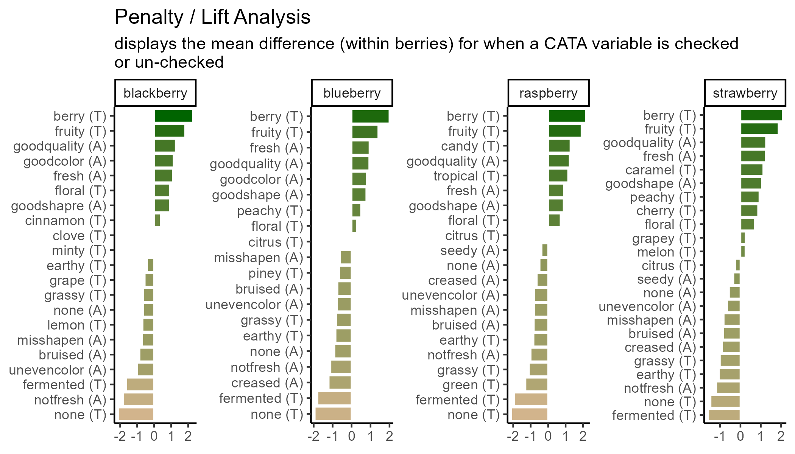
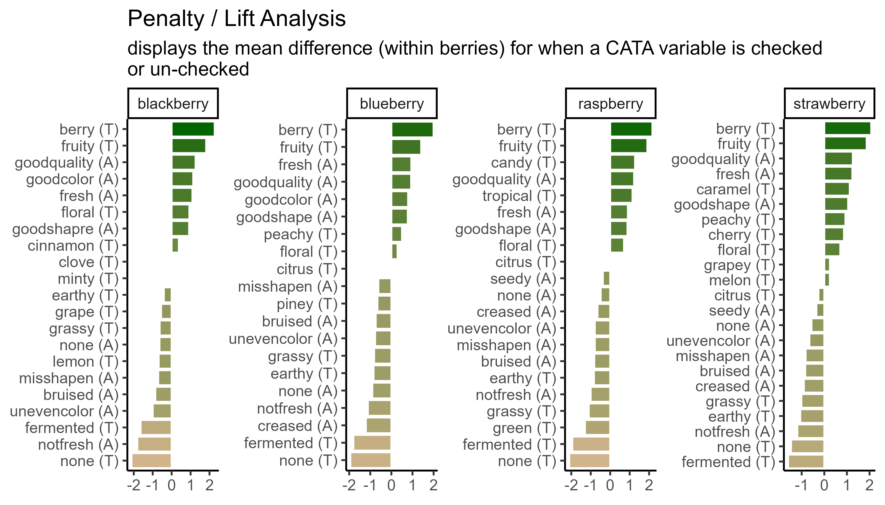

# (APPENDIX) Appendix


## Image Sizes and Raster Resolutions {#ggresolution}

### Simpler Sizing: Vector Images
You might be surprised that vector images have height and width options, because we said they don't have a fixed display size, but as you saw in [Chapter 5](#exporting-a-plot-in-multiple-formats), `ggsave()` picked a default image size of 7x7 inches when we didn't specify. The height and width are mostly important for determining the relative sizing of elements like text and whitespace.

`ggplot2` actually saves the sizes of certain plot elements, namely *text* and most `geom_*()`s, in inches or millimeters. When it has to construct an actual version of the plot at a given size, it tries to keep all of the 12-pt text 1/6" tall (1 inch = 72 points). This 12-point font will take up a very small amount of a 4-foot-tall image, but a sixth of a 1" image.

The fact that you can then print the `.svg` at any size you want is out of `ggplot2`'s hands. It will try to make the fonts and elements the right size for the size you're *telling it* you will print.

This means that the `scale` argument of `ggsave()`, for vectors, can just change the output size as long as you keep the same aspect ratio. It doesn't change the number of points per inch, and it doesn't change the point-size of any fonts or other elements in the plot. It's easier to just print a different size figure.

If you try to use this same trick for raster images, your picture **will not be $width \times dpi$ pixels wide**. This has flummoxed many a researcher trying to export very large, crisp figures for a poster.

### Raster Image Resolutions

All raster images are made up of grids of dots or pixels. Once you export a figure from `R` as a `.png`, `.jpeg`, or other raster format, *you cannot resize it*. It will look blurry or blocky if you try to make it bigger, and even slight changes to the **aspect ratio** ($width/height$), the text and other plot elements will be noticeably stretched out.

You'll have fewer problems if you save an image that's way too big (i.e., has too many pixels) for what you need, so long as it's the right aspect ratio and all the plot elements have relative sizes that work at the scale you'll be printing. (See [this short primer on "Using `R` Plots in Documents" from the University of Wisconsin-Madison](https://sscc.wisc.edu/sscc/pubs/using-r-plots/saving-plots.html#file-dimensions) for examples.)

So, how big is a pixel? How many pixels are in an inch? It depends! (On the pixel density for screens and the resolution for printing, see [the discussion on this page](https://graphicdesign.stackexchange.com/questions/6080/what-is-the-difference-between-dpi-dots-per-inch-and-ppi-pixels-per-inch) for details.)

- Most modern computer monitors have something like 90-120 pixels per inch (ppi)
- Microsoft Powerpoint uses an internal resolution of 96 ppi as a default, [although images will print at more than 96 dpi if they're sized appropriately](https://www.brightcarbon.com/blog/powerpoint-picture-size-and-resolution/).
- Older Apple software has a default of 72 ppi
- `ggsave()` uses a default of 300 dpi
- Poster printers will usually print at 300 dots per inch (dpi). They may ask for a minimum resolution of anywhere between 120-300 dpi, although 300 dpi will usually be a safe bet. Use your specific printer's recommendations.
- Elsevier journals like *Food Quality and Preference* [suggest at least 300 dpi for all images and at least 500 dpi for "combination art", which includes all `R` plots with colored or shaded areas](https://www.elsevier.com/about/policies-and-standards/author/artwork-and-media-instructions/artwork-sizing).

This is important because, if you have a 600x600-pixel raster image, and you try to print it any bigger than 2 inches x 2 inches on a 300 dpi printer, then you have *missing image data* and the printed version will look blurry.

Whenever something, like a design software or an `R` function to save a plot, gives you the chance to enter an image size in inches or centimeters, *you should figure out what dpi or ppi it's using*. It may be easier to figure out the final pixel size you want and export something that size or bigger. (For more details, see [this guide on "Preparing Images for PowerPoint, the Web, and Publication" from the University of Michigan](https://apps.lib.umich.edu/files/services/exploratory/pdfs/preparingimages.pdf). It's slightly outdated, so ignore the specific dpi/ppi numbers.)

You can see the possible image widths and corresponding pixel sizes for Elsevier journals [here](https://www.elsevier.com/about/policies-and-standards/author/artwork-and-media-instructions/artwork-sizing). For PowerPoint presentations, assume you're filling a 13.3x7.5" space at 150 dpi. For printed posters, you'll find the final poster size on the competition guidelines and the final resolution from your printer. 12"x12" for a single figure at 300 dpi is a good place to start.

You *will* almost certainly have to re-export your figures several times in order to get the sizing and aspect ratios right.

Let's save a the same plots as a raster image (`.png`) with a few different `dpi` values.


```r
ggsave("img/penalty-lift-png-50dpi.png", p1_berry_penalty,
       width = 7, height = 4, units = "in", dpi = 50)

ggsave("img/penalty-lift-png-300dpi.png", p1_berry_penalty,
       width = 7, height = 4, units = "in") #default dpi = 300

ggsave("img/penalty-lift-png-500dpi.png", p1_berry_penalty,
       width = 7, height = 4, units = "in", dpi = 500)
```

7x4" at 50 dpi:


7x4" at 300 dpi (the `ggsave()` default):



7x4" at 500 dpi:



You can see that all of the 7x4" raster plots look basically the same, except the first one is a little blurry when it's sized up to match the other two on your probably ~100 dpi monitor. This is the problem we're trying to avoid.

Unlike `scale`, the `dpi` argument does not resize any of the text or geoms (it doesn't change the size of a "point" from 1/72"). But let's say we need a 300 dpi copy of this image printed at 14x8". We already know that the 14x8" output has text that's too small to read from afar.

In cases like these, it may be easier to output a size with the right *aspect ratio* that looks good and is legible, then figure out what `dpi` you'll need to print it. If we need a 14x8" plot at 300 dpi, that's $14 \times 300 = 4200$ pixels wide by $8 \times 300 = 2400$ tall. We can fake this with our 7x4" plot at 600 dpi, since $4200 / 7 = 600$ and $2400 / 4 = 600$.

## Regular Expressions {#regex}
A regular expression, or regex, is a way of compactly writing a `pattern` that will let you match similarly-structured pieces of text. You may use regex because you want the list of matches itself, because you want to do something to pieces of text with a certain pattern somewhere in them, or because you want to replace all matches with something else. Regex were originally designed in the 1980s, and are also a central part of the design of the `stringr` package (although `stringr` still has a lot of useful tools without them).

If you wanted to match all words ending in "ly", you could use `\\b\\w+ly\\b`, which looks for a word boundary (`\\b`), followed by at least one (`+`) "word character" (`\\w`, mostly letters), followed by the letters "ly", followed by another word boundary. You can use a similar regex to find all integers (`\\b\\d+\\b`) or expand it to find integers *and* numbers with a decimal (`\\b\\d+(\\.\\d+)?\\b`).

Mostly, Regex are very powerful and very difficult to read. We'll provide a few semi-realistic examples in action to show off just how powerful they can be, and just how messy they look:


```r
str_extract("If you want to get in touch with me you can do so at lhamilton@vsu.edu.",
            "\\w*@\\w+\\.(edu|gov|com|org|biz|net|fr|co\\.uk)\\b")
```

```
## [1] "lhamilton@vsu.edu"
```

```r
str_extract_all("Our 300th measurement was 10.31 cm, our 301st clocked in at 3.213in",
            "\\d+\\.\\d+ ?(cm|in|m)")
```

```
## [[1]]
## [1] "10.31 cm" "3.213in"
```

```r
str_extract_all("Regular Expressions (regex) are one tool in Natural Language Processing (NLP)",
            "(?<=\\()[^)]*(?=\\))")
```

```
## [[1]]
## [1] "regex" "NLP"
```

You can try changing the searched `string` in the above code to see if it recognizes your email or how many numbers you can get it to recognize. Usually, though, your plot labels aren't in full sentences in your data frame. Simpler regular expressions can still save you a lot of work. Without regular expressions, our main penalty analysis example has to `separate()` the CATA variable names into two parts, use a `case_when()` to individually match the modalities to a cleaned-up "(A)" or "(T)", and then finally `unite()` them back into one column:


```r
berry_penalty_analysis_data %>%
  select(-count) %>%
  pivot_wider(names_from = checked,
              values_from = penalty_lift,
              names_prefix = "checked_") %>%
  separate(cata_variable, 
           into = c("mode", "variable"), 
           sep = "_") %>%
  mutate(mode = case_when(mode == "taste" ~ "(T)",
                          mode == "appearance" ~ "(A)",
                          mode == "appearane" ~ "(A)")) %>%
  unite(variable, mode, col = "cata_variable", sep = " ")
```

```
## # A tibble: 85 × 4
##    berry      cata_variable   checked_0 checked_1
##    <chr>      <chr>               <dbl>     <dbl>
##  1 blackberry fresh (A)            4.70      5.80
##  2 blackberry goodcolor (A)        4.63      5.77
##  3 blackberry goodquality (A)      4.69      5.96
##  4 blackberry goodshapre (A)       4.93      5.86
##  5 blackberry misshapen (A)        5.63      4.92
##  6 blackberry none (A)             5.42      4.78
##  7 blackberry notfresh (A)         5.57      3.76
##  8 blackberry unevencolor (A)      5.53      4.53
##  9 blackberry bruised (A)          5.53      4.67
## 10 blackberry berry (T)            4.21      6.49
## # ℹ 75 more rows
```

With regular expressions, you can combine all of this in one step:


```r
berry_penalty_analysis_data %>%
  select(-count) %>%
  pivot_wider(names_from = checked,
              values_from = penalty_lift,
              names_prefix = "checked_") %>%
  mutate(cata_variable = str_replace(cata_variable,
                                     "^(.).*_(.*)",
                                     "\\2 (\\1)"),
         cata_variable = str_to_title(cata_variable))
```

```
## # A tibble: 85 × 4
##    berry      cata_variable   checked_0 checked_1
##    <chr>      <chr>               <dbl>     <dbl>
##  1 blackberry Fresh (A)            4.70      5.80
##  2 blackberry Goodcolor (A)        4.63      5.77
##  3 blackberry Goodquality (A)      4.69      5.96
##  4 blackberry Goodshapre (A)       4.93      5.86
##  5 blackberry Misshapen (A)        5.63      4.92
##  6 blackberry None (A)             5.42      4.78
##  7 blackberry Notfresh (A)         5.57      3.76
##  8 blackberry Unevencolor (A)      5.53      4.53
##  9 blackberry Bruised (A)          5.53      4.67
## 10 blackberry Berry (T)            4.21      6.49
## # ℹ 75 more rows
```

And you can even go farther by combining multiple replacements (for typos, for adding in spaces, etc) in one call to `str_replace_all()`.


```r
berry_penalty_analysis_data %>%
  select(-count) %>%
  pivot_wider(names_from = checked,
              values_from = penalty_lift,
              names_prefix = "checked_") %>%
  mutate(cata_variable = str_replace_all(cata_variable,
                                         c("^(.).*_(.*)" = "\\2 (\\1)",
                                           "good" = "good ",
                                           "not" = "not ",
                                           "shapre" = "shape",
                                           "uneven" = "uneven ")),
         cata_variable = str_to_title(cata_variable))
```

```
## # A tibble: 85 × 4
##    berry      cata_variable    checked_0 checked_1
##    <chr>      <chr>                <dbl>     <dbl>
##  1 blackberry Fresh (A)             4.70      5.80
##  2 blackberry Good Color (A)        4.63      5.77
##  3 blackberry Good Quality (A)      4.69      5.96
##  4 blackberry Good Shape (A)        4.93      5.86
##  5 blackberry Misshapen (A)         5.63      4.92
##  6 blackberry None (A)              5.42      4.78
##  7 blackberry Not Fresh (A)         5.57      3.76
##  8 blackberry Uneven Color (A)      5.53      4.53
##  9 blackberry Bruised (A)           5.53      4.67
## 10 blackberry Berry (T)             4.21      6.49
## # ℹ 75 more rows
```

You do not *have* to learn regular expressions to clean up messy text, but being comfortable with them will (eventually) make you faster. You should at least learn the characters (`\`, `.`, `[`, `]`, `{`, `}`, `(`, `)`, `<`, `>`, `*`, `+`, `-`, `=`, `!`, `?`, `^`, `$`, and `|`) that will need to be **escaped** with two backslashes if you need to replace them. It will help you troubleshoot any weird results you get from the `str_*()` functions.

If you want to learn more, we'd recommend starting with [the `stringr` package's own vignette on regular expressions](https://stringr.tidyverse.org/articles/regular-expressions.html), which you can view with `vignette("regular-expressions", "stringr")`. If you want more practice, you can then follow along with the [RegexOne](https://regexone.com/) tutorial or [RegexTutorials](http://regextutorials.com/index.html).

Any "perl-flavored" regex tutorial or resource will work, with the exception that *you will have to double the number of backslashes (`\`)* to use them in `R`.

